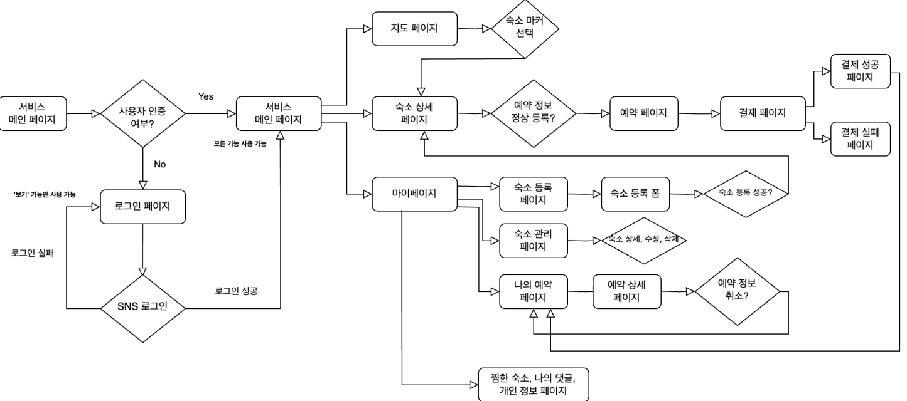
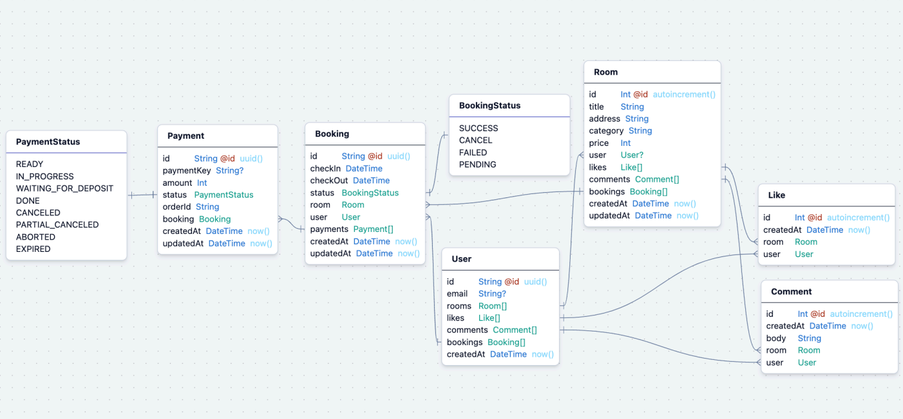

# WhiteMouseBnB

## 숙박 예약 플랫폼 요구사항 (RFP)

### 1. 메인 페이지
- **속성 데이터 모듈**: 사용자 입력을 통해 데이터를 수집하고, 데이터를 기반으로 사용자의 요구에 맞는 솔루션을 제공.
- **편리한 사용성**: 사용자는 손쉽게 데이터를 입력하고 필요한 정보를 얻을 수 있습니다.

### 2. 사용자 인증
- **SNS 연동**: 간편한 SNS 로그인을 통해 사용자 인증을 진행.
- **데이터 보안**: 사용자의 정보는 안전하게 보호되며, 사용자가 원할 때만 데이터에 접근할 수 있습니다.

### 3. 데이터 관리
- **CSV 파일 출력**: 사용자가 입력한 데이터를 CSV 파일로 내보내기.
- **동적 데이터 처리**: 입력된 데이터를 실시간으로 처리하여, 사용자에게 최신의 정보를 제공.

### 4. 이메일 및 결제 시스템
- **이메일 알림**: 중요한 정보나 업데이트가 있을 때 사용자에게 이메일로 알림.
- **결제 기능**: 사용자가 필요한 추가 서비스에 대해 간편하게 결제할 수 있는 기능을 제공.

### 5. 성능 분석
- **페이지 렌더링 분석**: Next.js 13의 최적화 기능을 활용하여, 빠른 페이지 로딩과 효율적인 리소스 관리를 실현.
- **실시간 데이터 처리**: 실시간 사용자 데이터 처리를 통해 사용자 경험을 최적화하고, 타이밍에 민감한 기능들을 즉각적으로 반영.

### 6. 사용자 인증
- **안전한 사용자 인증**: 사용자 정보를 안전하게 관리하며, SNS 로그인 등을 통해 간편하게 접근 가능.
- **다중 인증 옵션 제공**: 다양한 인증 방법을 제공하여 사용자의 접근성을 높임.

### 7. 데이터 관리
- **데이터 내보내기**: 사용자 입력 데이터를 CSV 파일로 손쉽게 내보낼 수 있음.
- **데이터 분석과 보고**: 사용자 활동 및 반응을 분석하여 효율적인 의사결정 지원.

### 8. 테스트 및 최적화
- **테스트 자동화**: 테스트 코드를 활용하여 전체 시스템의 안정성을 보장.
- **E2E 테스트 실행**: 사용자의 입장에서 시스템 전체의 흐름을 테스트하여 예상치 못한 문제를 사전에 발견하고 해결.

### 9. 비즈니스 분석
- **Google Analytics 통합**: 웹사이트의 트래픽 및 사용자 행동을 분석하여 마케팅 전략 및 개선 사항을 도출.
- **성과 측정 및 보고**: 데이터 기반의 결정을 통해 비즈니스 성과를 지속적으로 모니터링하고 개선 방안을 마련.


## 프로젝트 설계 (폴더 구조)

```
📦src/
├── 📂app/                    # 앱 라우터 구조 적용
│   ├── 📂api/                # Route Handler를 이용한 API 작업
│   └── 📂(home)/             # 라우트 그룹을 사용하여 동일한 레이아웃 사용하는 페이지 묶기기
├── 📂components/             # 공통으로 사용하는 컴포넌트 정리리
│   └── 📂ui/                 # 공통 UI 컴포넌트 (Card, Avatar 등)
├── 📂atom/                   # Recoil를 이용한 전역 상태관리 값 정리
├── 📂constants/              # 자주 사용하는 상수 데이터 (navigationItems 등)
├── 📂db/                     # prisma를 불러오는 함수 정의의
├── 📂hooks/                  # 공통 훅 정리 (intersection hook)
├── 📂interface/              # 인터페이스 및 타입 정의    
└── 📂utils/                  # 파이어베이스 설정 정의
```

## 사용 기술 정리

- **프로젝트 세팅 및 개발툴**
  - Next.js 13, React, ESLint, Prettier, Supabase, Prisma
  - TailwindCSS, react-calendar, recoil, React Query, Next-auth
  - react-hook-form, firebase storage

- **도메인 설정 및 배포**
  - Godaddy, Vercel

- **성능 최적화 및 분석**
  - Lighthouse, @next/bundle-analyzer, Google Analytics
  - Google Search Console, Naver Search Advisor

- **테스트 코드 및 디자인 시스템**
  - Cypress, Storybook


## 페이지 빌드 및 렌더링 메커니즘

1. **SSG (Static Site Generation)**
   - 데이터 변환 없이 빠른 페이지 로딩을 위한 SEO 친화적인 방법
   - FAQ 페이지 등 변동이 적고, 일반적으로 동적으로 변화가 없는 콘텐츠에 적합
   - 빌드 타임에 모든 페이지가 미리 생성되며, 변경사항을 반영하기 위해서는 재빌드 필요

2. **SSR (Server Side Rendering)**
   - 서버 측에서 HTML을 직접 생성하여 클라이언트로 전송
   - 실시간 데이터 필요성이 높거나 사용자 인증이 필요한 페이지에 적합
   - 요청 시마다 페이지를 새로 생성하여 제공

3. **ISR (Incremental Static Regeneration)**
   - 일부 페이지만 선택적으로 재생성
   - 사용자 요구에 따라 콘텐츠를 동적으로 갱신할 수 있는 혼합된 방식
   - 사용자의 접근에 따라 서버가 필요할 때만 선택적으로 페이지를 재생성하여 제공

4. **CSR (Client Side Rendering)**
   - 클라이언트에서 JavaScript를 사용해 페이지를 동적으로 생성
   - 대부분의 논리와 UI 렌더링이 클라이언트에서 처리
   - 초기 로딩 후, 사용자의 상호작용에 따라 필요한 부분만 동적으로 갱신
   - 사용자 경험 향상 및 서버 부하 감소 가능

## 아키텍처 설계 (다이아그램)



## 아키텍처 설계 (스키마 다이아그램)



## API 설계

프로젝트에서는 다음과 같은 REST API를 제공하여, 솔루션의 핵심 기능을 지원합니다. 이 API들은 방을 생성, 조회, 수정, 삭제하는 기능을 제공하여 사용자가 효과적으로 데이터를 관리할 수 있게 도와줍니다.

### 방 관리 API

- **방 생성하기**
  - `POST /api/rooms`: 새로운 방을 생성합니다.
  - 필요 데이터: 방에 대한 정보(예: 이름, 위치 등)

- **방 리스트 / 상세 조회**
  - `GET /api/rooms`: 모든 방의 리스트를 조회합니다.
  - `GET /api/rooms?id=[id]`: 특정 방의 상세 정보를 조회합니다.

- **방 수정하기**
  - `PATCH /api/rooms?id=[id]`: 특정 방의 정보를 수정합니다.
  - 필요 데이터: 수정할 정보(예: 이름, 위치 변경 등)

- **방 삭제하기**
  - `DELETE /api/rooms?id=[id]`: 특정 방을 삭제합니다.

이 API들은 사용자가 웹 인터페이스를 통해 방을 효율적으로 관리할 수 있도록 설계되었습니다. 각 API 요청 및 응답은 JSON 형식으로 처리됩니다.
